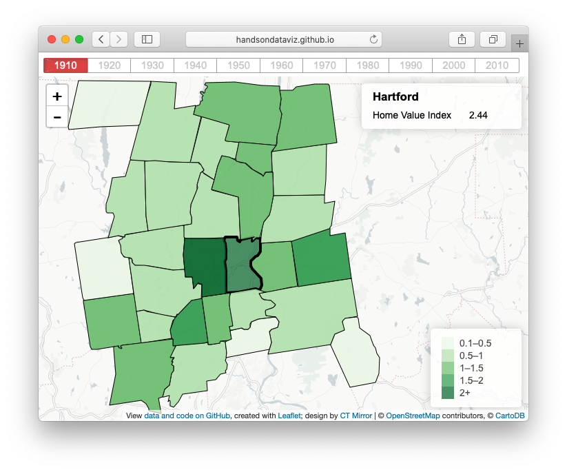

# leaflet-map-polygon-tabs
Leaflet thematic polygon map, with hover info, tabs to display time periods, and data drawn from GeoJSON file.

  

                                                                                     
## Demo
https://handsondataviz.github.io/leaflet-map-polygon-tabs

## Credits
- Map design by [@alvinschang](https://github.com/alvinschang) Connecticut Mirror http://ctmirror.org
- Code improvements by [@ilyankou](https://github.com/ilyankou)

## Pros
- Hover over polygon to view info; or tap polygon in mobile devices
- Click tabs or keyboard arrow keys to flip through data series (such as decades or categories)
- Easily create and upload data by joining a CSV table to a GeoJSON map boundary in MapShaper.org

## Cons
- Automated legend displays only numerical ranges, not text values
- This version displays only one GeoJSON map boundary

## Create your own
- see Leaflet templates section of *Hands-On Data Visualization* book https://handsondataviz.org
